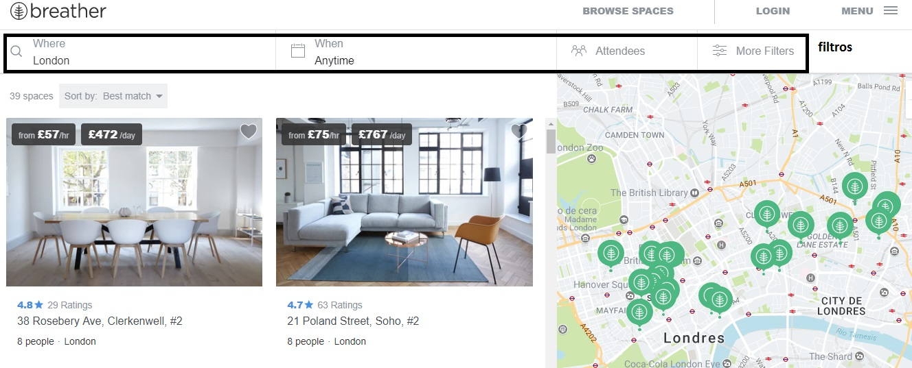
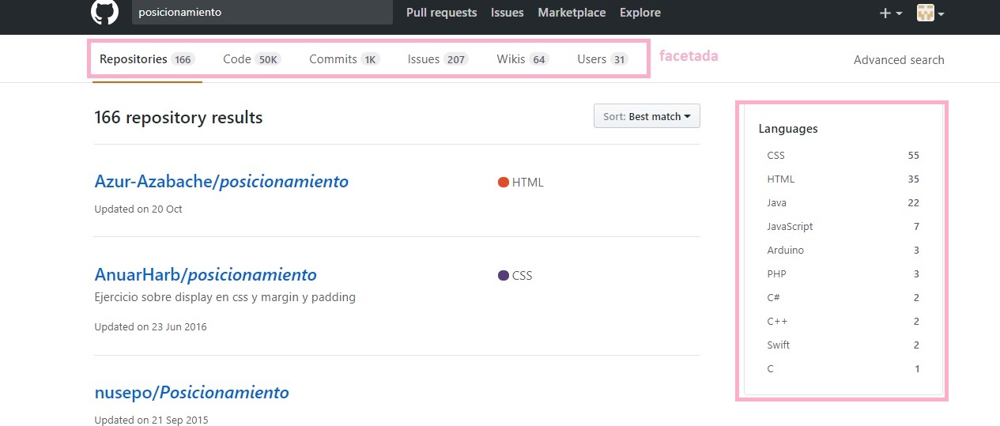
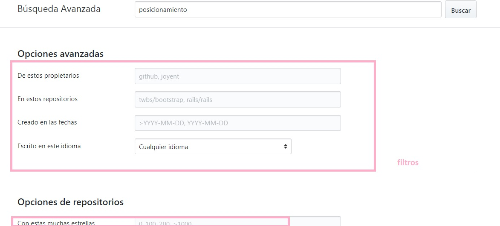
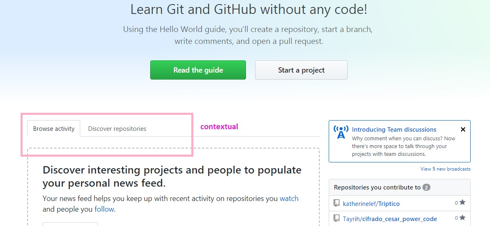
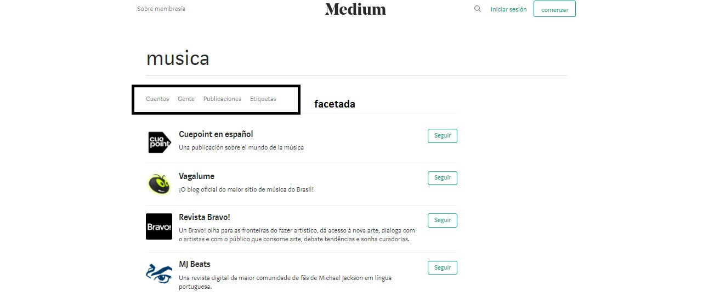
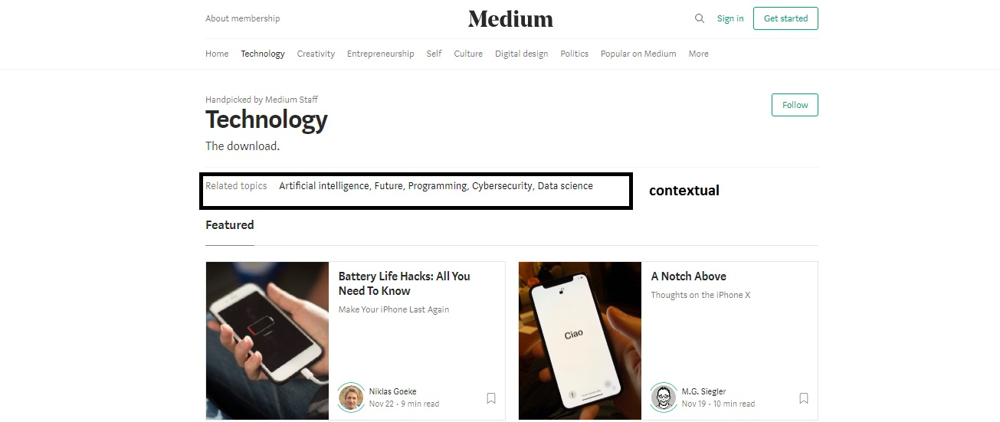
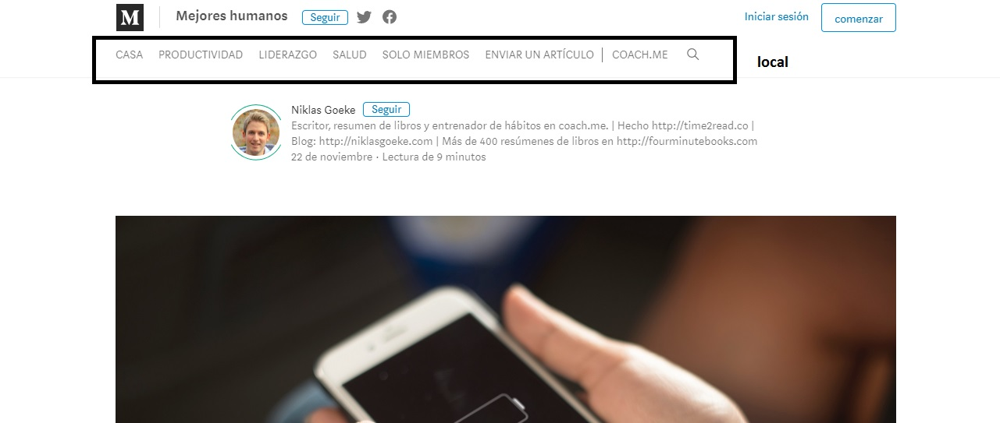

### "Navegación en webs" ###

--------------------------------------------------------------

1) __OBJETIVO__

  Para este ejercicio nos indican que debemos identificar los elementos de navegación en los siguientes sites:

  * Breather

  * Github

  * Medium

2) __DESARROLLO__

  2.1 __Breather__

   A) Navegación Global :

  

   B) filtros :

  

   C) contextual :

  

  2.2  __Github__  

   A) Navegación Global:

  

   B)Facetada:

  

   C) filtros:

  

   D) contextual:

  

2.3  __Medium__   

   A) navegación global:

  

   B) facetada:

  

   C) contextual:

  

   D) local:

  
